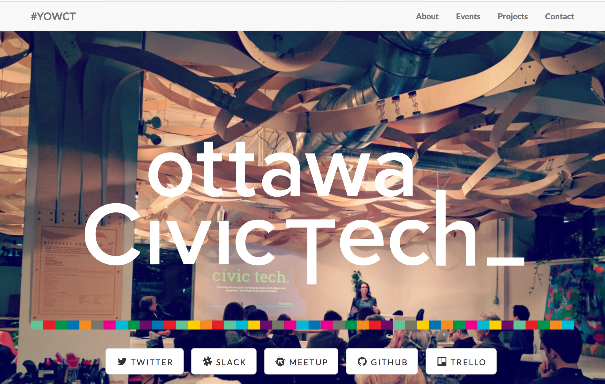
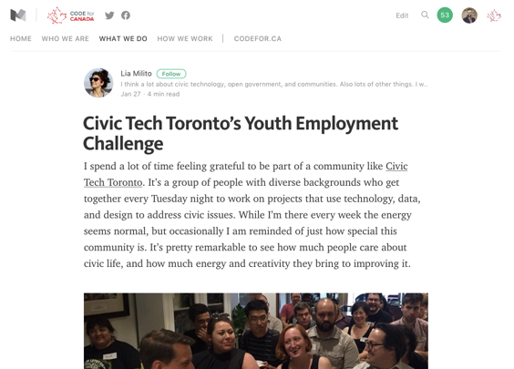
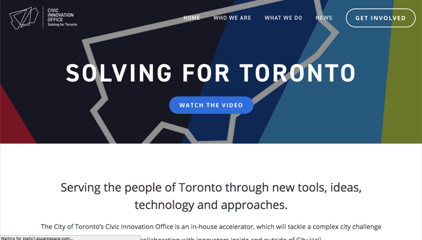
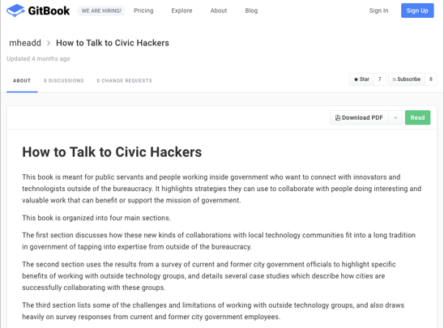
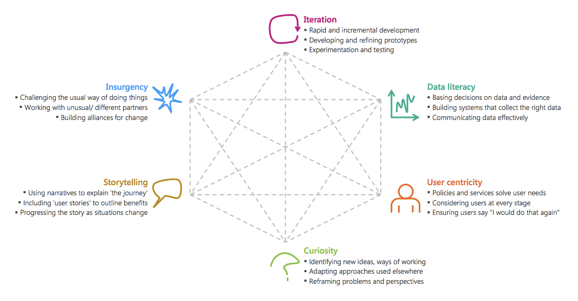
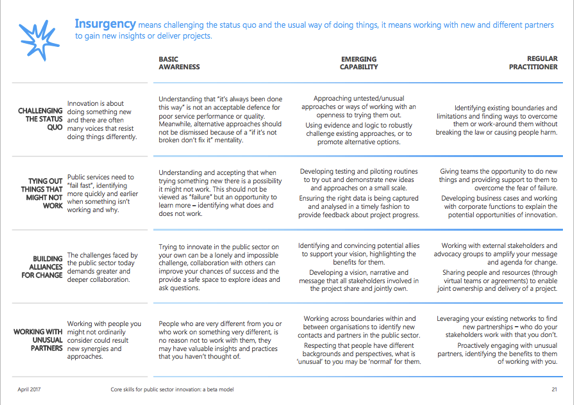

class: center, middle

# Civic Tech: Insurgency

---

class: middle
 
# Agenda

 6:30-6:45: Guest:
 
 6:45-7:45: Working across silos: Externally
 
 7:45-8:05: Break
 
 8:05-8:45: Working across silos: Internally
 
 8:45-9:30: Activity

[NOTE]: This session is interactive, please engage in questions

---

class: middle

# Working across silos

---

class: middle

# Working across silos: externally
 
- Civic tech
- Civic Tech Toronto hacknights
- CodeAcross Toronto
- Youth Employment Challenge
- Student Pathways Challenge
- bike parking project
- Startup in residence/ Civic Innovation Office
- Mark Headd's gitbook
 
---

class: middle 

.full-image-slide[]
 
---

class: middle 

.full-image-slide[]

---

class: middle 

# Code for Canada Challenges

Challenge-based engagement between Code for Canada, Civic Tech Toronto and Employment and Social Development Canada (ESDC)

Six weeks + $5000 = six community-developed prototype solutions based on human-centered design ($20k in volunteer time!)
 
---

class: middle 

.full-image-slide[]

---

class: middle 

.full-image-slide[]

---

class: middle 

.full-image-slide[]

---

class: middle 

# Qs
 
## Which of these seem most important or impactful?
## What would you be interested in trying out, or sharing with colleagues?
 
- Civic tech
- Civic Tech Toronto hacknights
- CodeAcross Toronto
- Youth Employment Challenge
- Student Pathways Challenge
- bike parking project
- Startup in residence/ Civic Innovation Office
- Mark Headd's gitbook

---

class: middle 

# Break 

---

class: middle 

# Working across silos: internally
 
- [Rebels at Work: A Handbook for Leading Change from Within](https://www.amazon.ca/Rebels-Work-Handbook-Leading-Change/dp/1491903953)
 - https://www.rebelsatwork.com/
- [Core Skills for Public Sector Innovation](https://www.oecd.org/media/oecdorg/satellitesites/opsi/contents/files/OECD_OPSI-core_skills_for_public_sector_innovation-201704.pdf)

---

class: middle 

.pull-left[

# Bad Rebels
- Complain
- Break rules
- Me-focused
- Problems
- Alienate
- Energy-sapping
- Assertions
- Pessimist
- Point fingers
- Worry that…
- Obsessed
 
]

.pull-right[

# Good rebels
- Create
- Change rules
- Mission focused
- Possibilities
- Attract
- Energy-generating
- Questions
- Optimist
- Pinpoint causes
- Wonder if…
- Reluctant

]

**Source: Rebels at Work**

---

class: middle 
 
# Secrets of successful rebels 1

# Tactics: Actions to achieve specific End
- Tap into the brilliance of others, knowing that no now can create meaningful change alone.
- Align ideas with the organization’s goals. The more important an idea is to an organization the more likely it will be adopted.
- Show how the benefits of change are commensurate with the costs of change.
- Use conflict productively: glean insignias from disagreement and conflict to learn how to remind and advance an idea.
- Let ideas breathe, give people time to absorb a new idea and consider its implications.

---

class: middle 
 
# Secrets of successful rebels 2
 
# Behaviours: How you conduct yourself toward others
- Stay positive: optimism inspires others to join them in fixing problems.
- Judge ideas, not people. Steer conversations away from personalities to focus on ideas and their merits.
- Learn from anger: consider what triggers anger and avoid spiralling into emotional drama.
- Respect others and consider different viewpoints.
- Know when to walk away, whinge the importance of the idea and the professional costs of preserving.
 
---

class: middle 

.full-image-slide[]

---

class: middle 

.full-image-slide[]

---

class: middle 

# Activity
 
---

class: middle 

# Activity (Part 1)

- Pick your current or a past team you worked with. 
- Of the 4 approaches, rank how able your selected team (overall) is, 1 (best) to 4 (worst).
- For the one you ranked 4, spend 3 minutes quietly thinking and taking notes about: [3m]
- A time your team tried this approach and it didn't work out
- An opportunity you see for trying this approach again
 
## Insurgency:
- Challenging the status quo
- Trying things that might not work out
- Building alliances for change
- Working with unusual partners
 
---

class: middle 

# Activity (Part 2)
 
- Find ONE partner -- someone you don't work with, for obvious reasons.
 - Share which team you picked, and which approach you ranked 4th. Then describe the past failure and future opportunity. [5m ea, 10m total]
- Go deeper, asking these questions (or others) of each other: [5m ea, 10m total]
 - Is this holding your team back?
 - Who are the key people who'd need to be convinced (to lead, or to not block)?
 - What could you do/say to influence those people?
 - Capture suggestions, insights, and blockers. (To potentially share back with the group.)
- Report back. [10m]
 
## Insurgency:

- Challenging the status quo
- Trying things that might not work out
- Building alliances for change
- Working with unusual partners
 
---

class: middle 

# Activity / report back notes:
- Breaking change into small chunks
- Route around blockers
- Challenges in the context of leadership changes, and defensiveness
- Reframing the risk: the risk of inaction
 - Benchmarking against different/better things 
