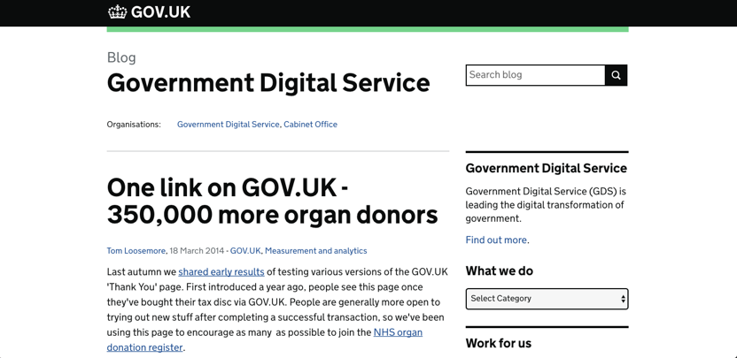
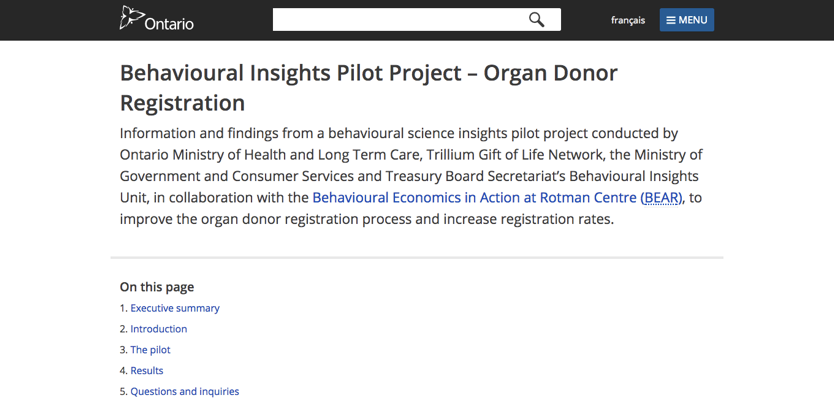
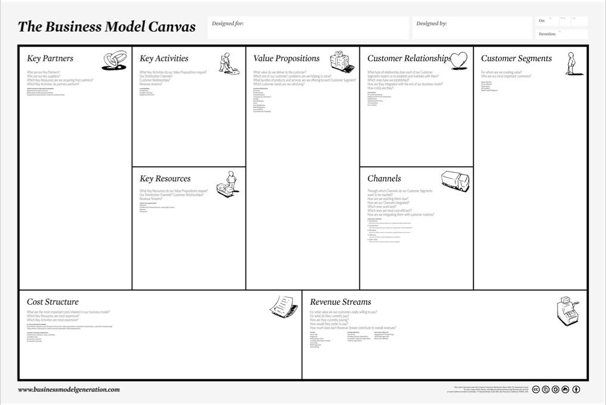
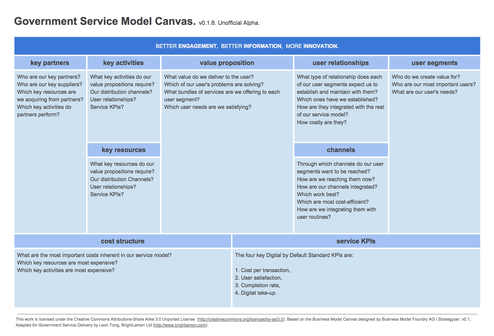
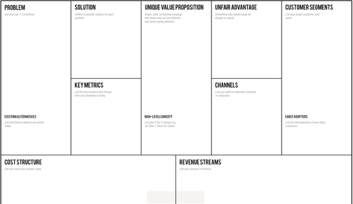
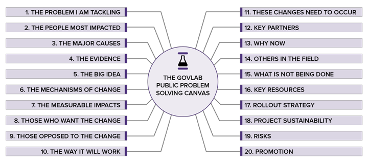

class: center, middle

# Civic Tech: User centricity

---

class: middle
 
# Agenda

 6:30-6:40: Warm-up: Organ donation registration
 6:40-7:40: Guest
 7:40-8:00: Midpoint review review
 8:00-8:20: Break
 8:20-8:35: Canvases
 8:35-9:30: Activity: Canvases

[NOTE]: This session is interactive, please engage in questions

---

class: middle

# Warm-up: 
Behavioural insights / organ donors

---

class: middle

.full-image-slide[]

---

class: middle

.full-image-slide[]

---

class: middle

# Guest: 
 
---

class: middle

# Break
 
---

class: middle

# Review
 
- Hacking policy 
- Adopting new/creative practices & tools
- Engaging users
- Testing our applications and work 
- Case studies & jurisdictional scans
- More resources to read and share
- Show-and-tell 
- Agile + procurement 
- Breaking down silos
- Getting buy-in
- Supporting colleagues & changemakers

---

class: middle

# Review
 
- Hacking policy **out of scope**
- Adopting new/creative practices & tools **getting buy-in**
- Engaging users **getting buy-in**
- Testing our applications and work **out of scope**
- Case studies & jurisdictional scans **it’s up to us**
- More resources to read and share **it’s up to us**
- Show-and-tell it’s **up to us**
- Agile + procurement **out of scope**
- Breaking down silos **week 7**
- Getting buy-in **week 7**
- Supporting colleagues & changemakers **week 7**

---

class: middle

# Out of Scope
 
- Hacking policy
 - Tom Loosemore @ Code for America Summit 2016: https://www.youtube.com/watch?v=5qI6Qw2_o_8
- Testing our applications and work
 - What are the barriers?
 - Usability Testing on 10 cents a day. (From Don't Make Make Think, by Steve Krug) http://sensible.com/downloads/DMMTchapter09_for_personal_use_only.pdf
- Agile + procurement
 - Emilio Franco (@emiliogfranco on Twitter): https://www.linkedin.com/pulse/agile-procurement-public-sector-primer-emilio-franco/
 - https://modularcontracting.18f.gov/

---

class: middle

# Getting buy-in
 
- Adopting new/creative practices & tools 
 - What are the barriers?

- Engaging users
 - What are the barriers?
 - Start with user interviews
 - Digital Service Standard: https://www.ontario.ca/page/digital-service-standard#section-3

---

class: middle

# It’s up to us
 
- Case studies & jurisdictional scans 
 - Online repositories
 - [David Eaves @ Harvard](https://eaves.ca/2010/04/14/case-study-open-data-and-the-public-purse/)
 - [Smarter State @ GovLab](http://www.thegovlab.org/smarterstate.html)
 - What else?
- More resources to read and share 
 - Communities of practice, e.g. [Municipal Innovators Community](http://municipalinnovators.ca)
 - Apolitical, CityLab, Twitter, #civictechnews on Civic Tech Toronto slack
 - What else?
- Show-and-tell
 - Sign up!

---

class: middle

# Canvases

---

class: middle

# Canvases
 
- [Business Model Canvas](https://en.wikipedia.org/wiki/Business_Model_Canvas)
- [Lean Startup Canvas](https://s-media-cache-ak0.pinimg.com/originals/7b/6c/23/7b6c233d40a18fc1e3f06b18bd987c7c.png)
 - [Why?](https://blog.leanstack.com/why-lean-canvas-vs-business-model-canvas-af62c0f250f0)
- [Government Service Model Canvas](http://brightlemon.com/blogs/one-page-business-plan-for-government-digital-services)
- [GovLab’s Public Projects Canvas](http://canvas.govlabacademy.org/)
- Civic Tech Canvas(es) / adapted for the Youth Employment Challenge:
 - https://drive.google.com/drive/u/0/folders/0B1-77GAKnNNASTUtN2JyYmdLdVU

Overview of some: http://www.nesta.org.uk/blog/tech4labs-issue-4-canvassing-value-proposition-your-public-lab-project

---

class: middle

.full-image-slide[]

---

class: middle

.full-image-slide[]

---

class: middle

.full-image-slide[]

---

class: middle

.full-image-slide[]

---

class: middle

# General case study:
- Situation
- Task
- Action
- Result

---

class: middle

# Activity

---

class: middle

# Activity: Canvases
 
 Pick one you’re interested in trying out.

 Sit with the others who want to work on the same one.

 Replicate your chosen canvas on paper, and fill it in for one of your current, future, or past projects.

 Everyone does their own, but feel free to talk through it. Or not, at first.

 Round 1: 15 minutes


 Round 2: 15 minutes. (Pick a different one, or go deeper)


 Debrief: 10 minutes.
